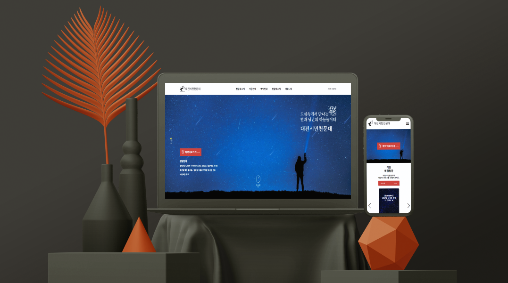

## 
 

###### 
클릭 시 데모 사이트 이동  👇

---

### 🖥프로젝트 소개

대전시민천문대 사이트에 메인화면 및 예약페이지 부분 리뉴얼

---

### ✅프로젝트 목적

메인 인덱스 부분을 가독성에 맞춘 새로운 레이아웃과 디자인,  예약시스템 페이지 부분의 편의성 개편 및 디자인,레이아웃을 반응형으로 재구성

---
### 👥프로젝트 역할

기획: 오정석, 이제은, 정다현

-개인 프로젝트 부분-

디자인/프론트엔드 : 오정석

---

### 🗓프로젝트 기간

2023년 2월 24일 ~ 2023년 3월 24일

---

### ⚙사용 툴

|                                                 HTML                                                 |                                                   CSS                                                    |                                                       JavaScript                                                       |                                                    Figma                                                     |
| :--------------------------------------------------------------------------------------------------: | :------------------------------------------------------------------------------------------------------: | :--------------------------------------------------------------------------------------------------------------------: | :----------------------------------------------------------------------------------------------------------: |
|  | </img> | </img> | </img> |

</img>

---

### 💡프로젝트 내 기능구현

-index부분의 모바일 gnb  
-swiper를 활용한 슬라이드  
-시설안내 및 안내문 부분 탭메뉴로 구성  
-달력 기능(codepen소스 수정해서 활용)  
-input요소 작성 시 정규식 표현 안내문구

---

### 🔗프로젝트 링크

약식 기획서 (구글 프레젠테이션) : [리뉴얼 기획서](https://docs.google.com/presentation/d/1PtCZ5NK-zUa_itFyQhS6pijREdrjelmpOlcfts9Cqdo/edit#slide=id.p, " 
proposal link")

와이어 프레임 (피그잼) : [와이어 프레임 및 회의](https://www.figma.com/file/jUD7SwCGpqrjIb4ZrvU2p2/C%EC%A1%B0_%EB%8C%80%EC%A0%84%EC%8B%9C%EB%AF%BC%EC%B2%9C%EB%AC%B8%EB%8C%80_%ED%86%A0%EB%A1%A0?node-id=0%3A1&t=akaat3hq5ajCgvxa-1, "wireframe")

메인 시안 (피그마) : [메인 디자인 시안](https://www.figma.com/file/bf3fQjXp41V1N2aMGA1qJI/%EB%8C%80%EC%A0%84%EC%8B%9C%EB%AF%BC%EC%B2%9C%EB%AC%B8%EB%8C%80-renewal?node-id=0%3A1&t=gPh3kxGYTjYH4nDk-1, "figma link")

퍼블리싱 (깃허브) : [퍼블리싱](https://github.com/jeong0214/Daejeon-Observatory, "publishing link")

---

### 👁️‍🗨️미리보기

</img>

 </img>

